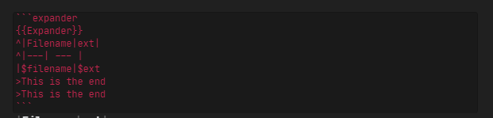

# Text {{expand}}


This plugin will search files using [Obsidian search functionality](https://publish.obsidian.md/help/Plugins/Search) 
and then paste result. The output can be customized using [template feature](#Template feature).

## Install
- If you have previous versions of plugin - remove them
- You need Obsidian v0.9.7+
- Get [Latest release](https://github.com/mrjackphil/obsidian-text-expand/releases/latest)
- Extract files and place them to your vault's plugins folder: `<vault>/.obsidian/plugins/`
- Reload Obsidian
- If prompted about Safe Mode, you can disable safe mode and enable the plugin. Otherwise head to Settings, third-party plugins, make sure safe mode is off and enable the plugin from there.

## How to use

-   Type `{{SEARCH_QUERY}}` in your note where `SEARCH_QUERY` a text which you want to search. 
Examples: `{{My Note}}`, `{{tag:#tag}}`.
-   Put a cursor on that line
-   Open command palette and find `Text {{expand}}:` commands (you can attach hotkeys in settings menu)

It should wrap the `{{ }}` line and add notes which was found below.
You can call command in a `{{ }}` line to update results.

### Template feature
Once `{{ }}` line wrapped you can use template functionality to extend output.




To create a list:
```expander
{{Expander}}
- [[$filename]]
```

or to create a table:
```expander
{{Expander}}
^|Filename|Content|
^|---|---|
|$filename|$content|
```


Syntax looks like that:
```expander
{{Expander}}
^This is a header
This line will be repeated for each file
Also, [[$filename]] <- this will be a link
>This is a footer
```

- Line prepended with `^` is a header. It will be added at the top of the list
- Line prepended with `>` is a footer. It will be added at the bottom of the list
- Line with no special symbol at start will be repeated for each file. Also, all special sequences will be extended.

#### Special sequences
- `$filename` - return a basename of a file
- `$letters`, `$lines` - return the full content of the file
- `$letters:10` - return 10 letters from the file. 10 could be replaced on any number
- `$lines:10` - return 10 lines from the file. 10 could be replaced on any number
- `$ext` - return extension of the file
- `$created`
- `$size`

## Support
- [Patreon](https://patreon.com/mrjackphil)
- [Paypal](https://www.paypal.com/paypalme/mrjackphil)
