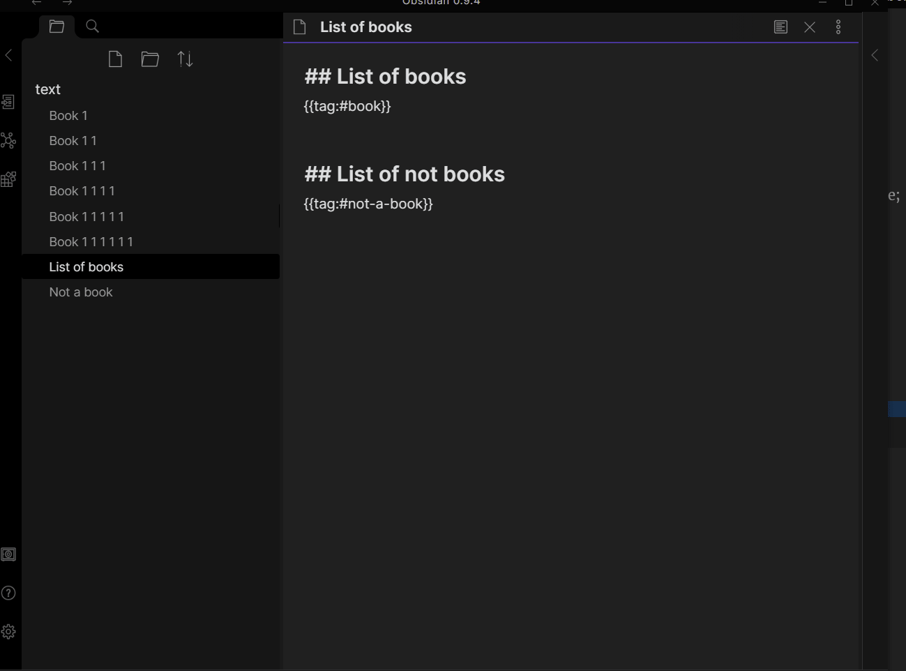

# Text expand

> Hey, if you like this plugin, you can support me using [Patreon](https://patreon.com/mrjackphil), [Paypal](https://www.paypal.com/paypalme/mrjackphil) or [Buy me a cofee](https://www.buymeacoffee.com/mrjackphil). 
> Or you can just share how plugin improves your note-taking experience. 
> Or just send me a message :)



This plugin will search files using [Obsidian search functionality](https://publish.obsidian.md/help/Plugins/Search) 
and then paste result. The output can be customized using [template feature](#template-feature).

## Install
- Just use built-in plugin manager and find `Text expand` plugin
### Manually
- You need Obsidian v0.9.18+ for latest version of plugin
- Get [Latest release](https://github.com/mrjackphil/obsidian-text-expand/releases/latest)
- Extract files and place them to your vault's plugins folder: `<vault>/.obsidian/plugins/`
- Reload Obsidian
- If prompted about Safe Mode, you can disable safe mode and enable the plugin. Otherwise head to Settings, third-party plugins, make sure safe mode is off and enable the plugin from there.

## How to use
- You should wrap your search request like that
```
    ```expander
    SEARCH_QUERY
    ```
```
- Open command palette (`Ctrl + P`)
- Find and run `Text expand: expand` command
- It should search and put results below the wrapped request

### Template feature
Using template feature you can customize an output. 
- Put template below the SEARCH_QUERY line
- Put a cursor inside code block with a templete 
-   Open command palette (`Ctrl+P`) and find `Text expand: expand` command

To create a list:

    ```expander
    SEARCH_QUERY
    - [[$filename]]
    ```

or to create a table:

    ```expander
    SEARCH_QUERY
    ^|Filename|Content|
    ^|---|---|
    |$filename|$lines:1|
    ```


Syntax looks like that:

    ```expander
    SEARCH_QUERY
    ^This is a header
    This line will be repeated for each file
    Also, [[$filename]] <- this will be a link
    >This is a footer
    ```

- Line prepended with `^` is a header. It will be added at the top of the list
- Line prepended with `>` is a footer. It will be added at the bottom of the list
- Line with no special symbol at start will be repeated for each file. Also, all special sequences will be replaced.

#### Special sequences
- `$filename` - return a basename of a file
- `$lines` - return the full content of the file
- `$lines:10` - return 10 lines from the file. 10 could be replaced on any number
- `$ext` - return extension of the file
- `$created`
- `$size`
- `$parent` - return parent folder
- `$path` - return path to file 
- `$frontmatter:NAME` - return frontmatter value from field `NAME`
- $header:HEADER - extract content of the HEADER, ex. `$header:##Ideas` or `$header:"## Plugins for Obsidian"`

## Settings
- Delay (default: `2000ms`) - the plugin don't wait until search completed. It waits for a delay and paste result after that.
- Line ending (default: `<--->`) - how will looks like the line below the expanded content
- Default template (default: `- [[$filename]]`) - how will look the expanded content when no template provided

